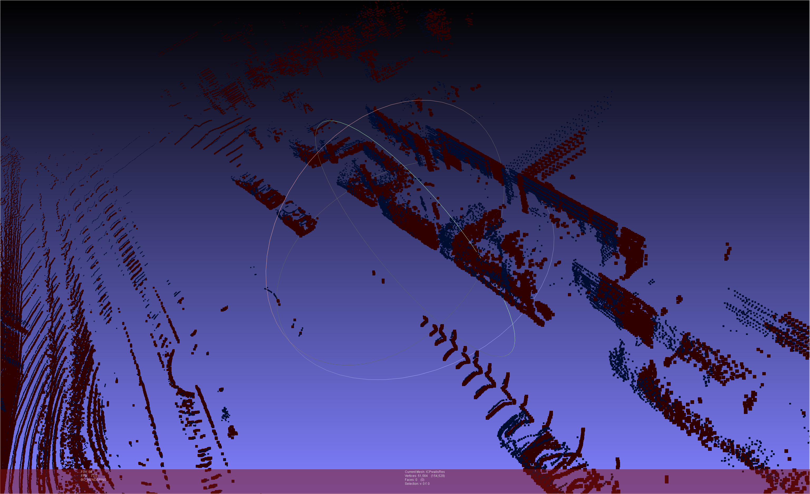
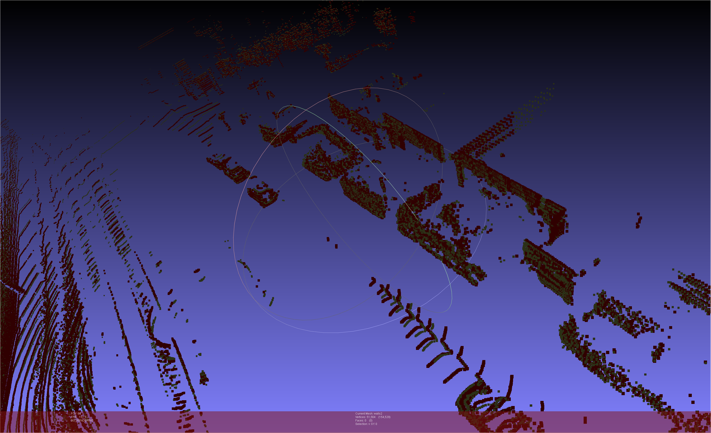
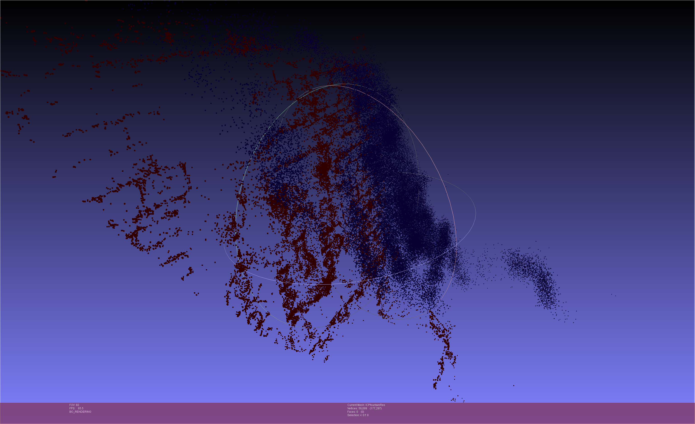
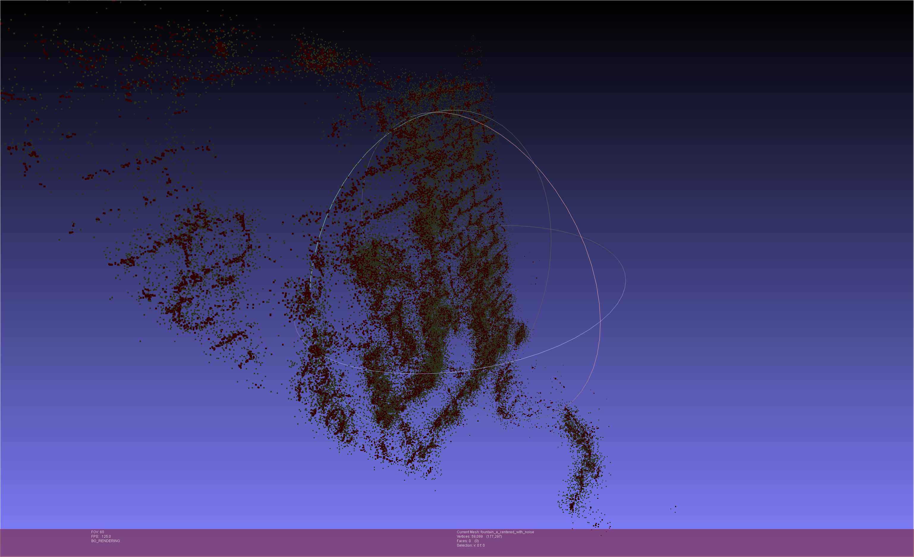
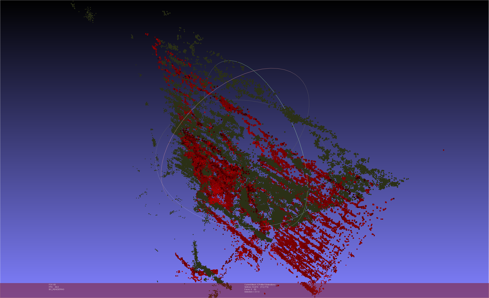
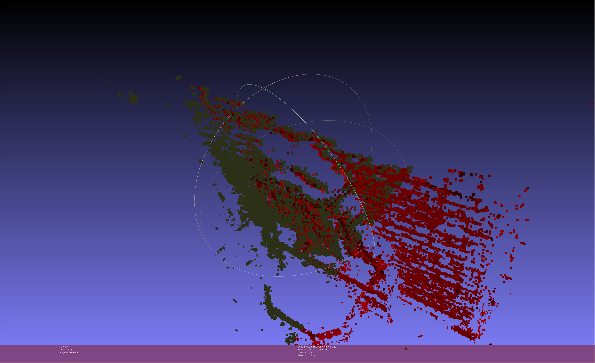
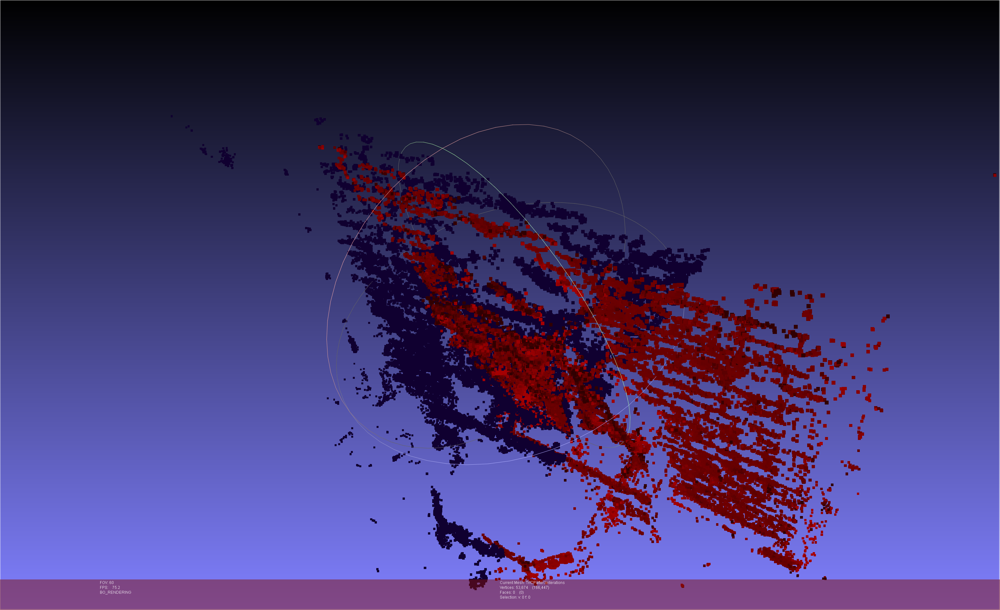

# Pointcloud registration
---

## Iterative closest point (ICP) algorithm results

Two pointclouds of walls, with high overlap

Blue pointcloud moved (green) to fit the red one

---

A pointcloud (red) and a translated, rotated, noisy copy of it (blue)

Blue pointcloud moved (green) to fit the red one

---

Results when applied to partially overlapping pointclouds. Mean squared error decreases, but the result is meaningless.
The green pointcloud moves "closer" but is not aligned.

## Trimmed Iterative closest point (TrICP) algorithm

Aligning based on only the top 60% closest pairs, the results are correct (MSE = 0.0043)

Starting position (MSE = 0.0606)

